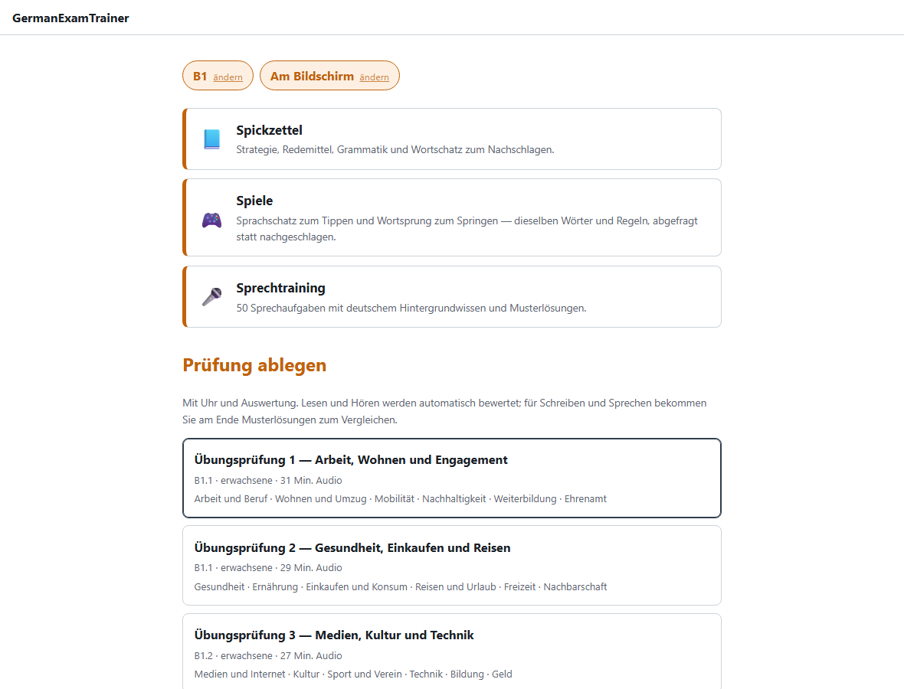
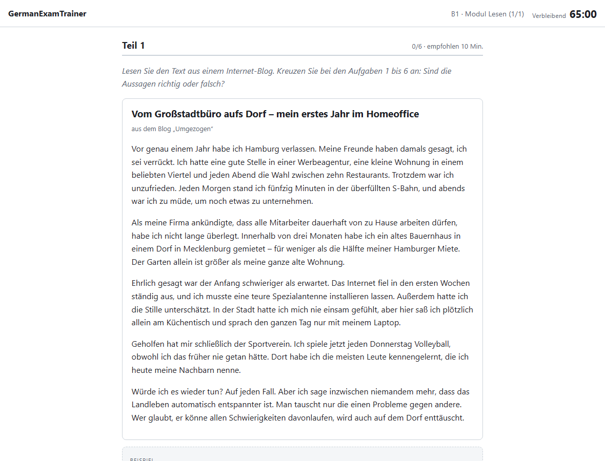
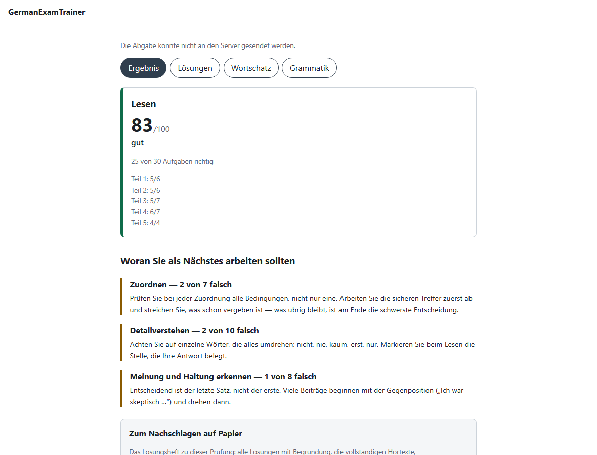
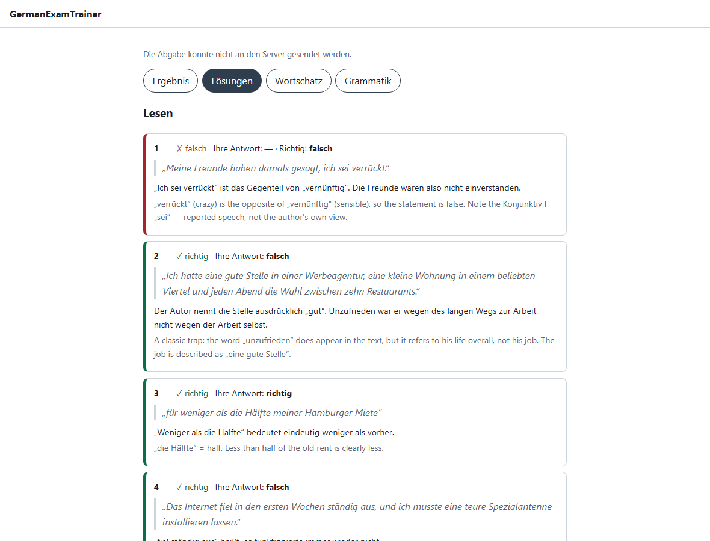
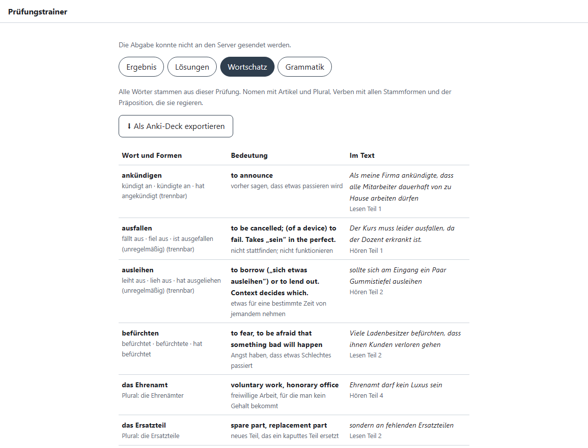
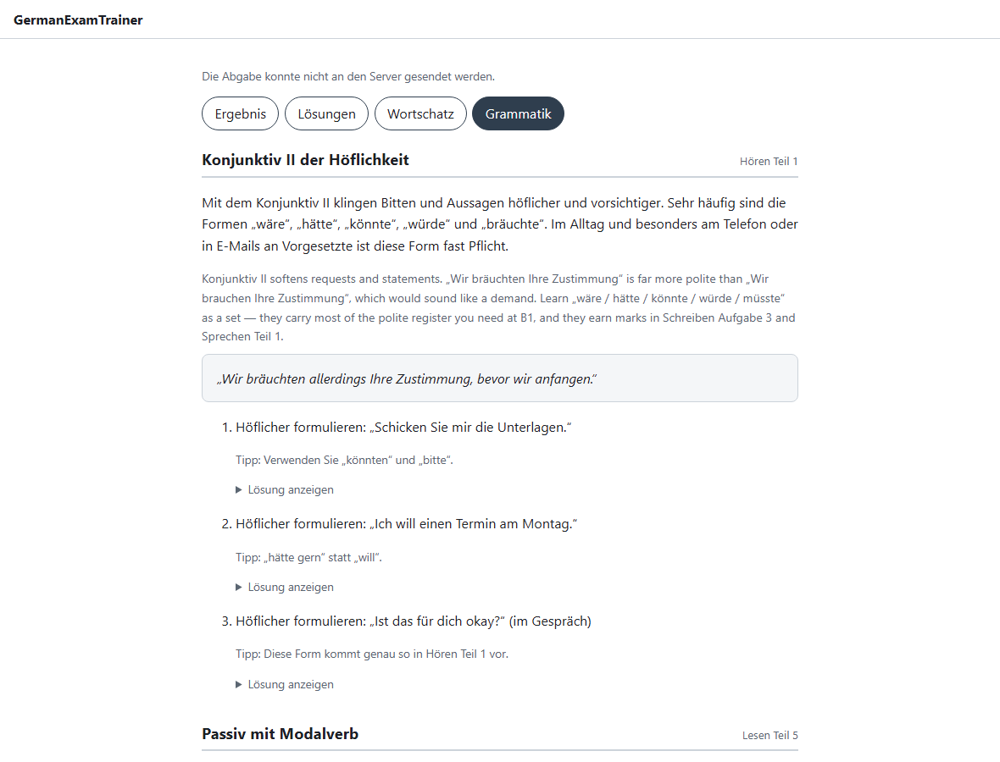
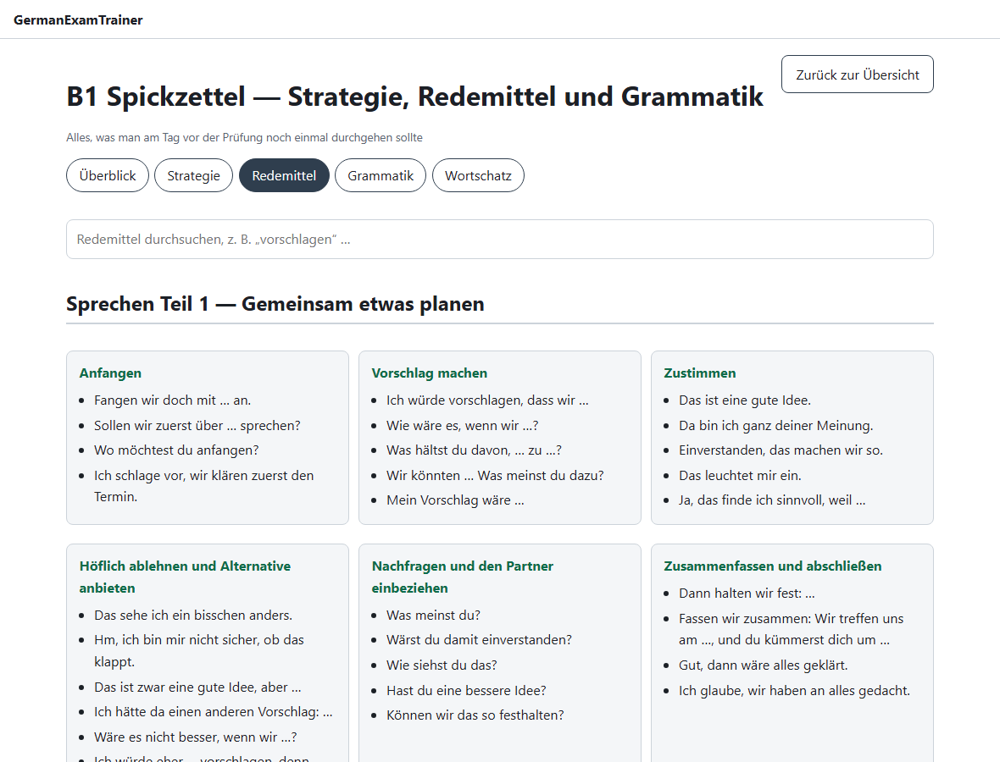
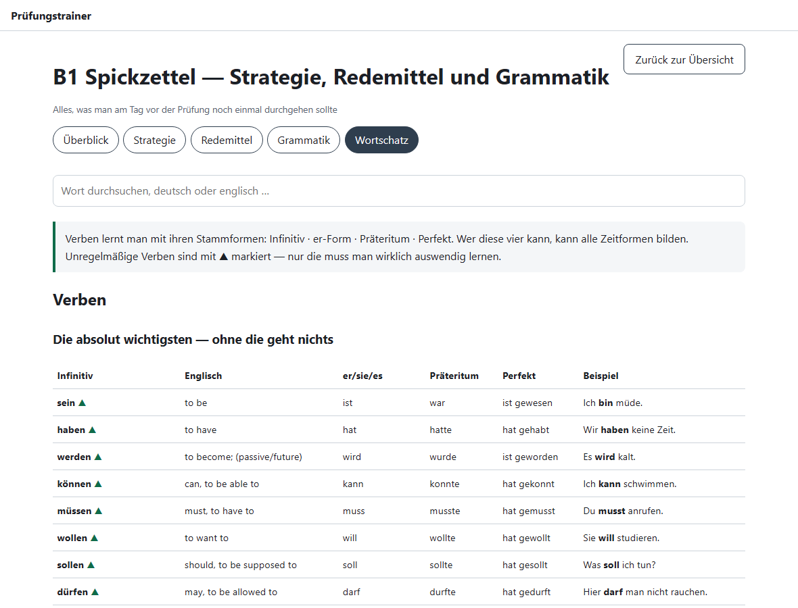

# b1-pruefungstrainer

**Free, open-source practice examinations for German B1 certificate exams** — full mock papers with generated listening audio, exam-accurate timers, automatic marking, a speaking recorder, and a post-exam glossary you can export to Anki — plus a printable cheat sheet of strategy, Redemittel, grammar and core vocabulary.

[](https://github.com/diprajkadlag/b1-pruefungstrainer/actions/workflows/ci.yml)
[](https://github.com/diprajkadlag/b1-pruefungstrainer/actions/workflows/content-validate.yml)
[](LICENSE)
[](LICENSE-CONTENT)

**▶ [Try it in your browser](https://diprajkadlag.github.io/b1-pruefungstrainer/)** — nothing to install, works offline after the first visit.

> ### ⚠️ Not an official examination
> This project provides practice material in the **format** of standard German B1 certificate examinations. It is **not affiliated with, endorsed by, or connected to Goethe-Institut e. V., telc gGmbH or the ÖSD**, and sitting these papers confers no certification. All exam content is original work written for this project. See [docs/DISCLAIMER.md](docs/DISCLAIMER.md).

---

|  |  |
|---|---|
|  |  |
| Pick a paper and the modules to sit | The reading module, with the timer running |
|  |  |
| Marked instantly, with what to work on next | Every item with its evidence and rationale |
|  |  |
| Vocabulary with all word forms → Anki | The grammar the paper actually tested |
|  |  |
| Redemittel for every part of Sprechen and Schreiben | The core vocabulary, searchable, with every verb form |

---

## What it does

**Sits a real paper.** Four modules on the published specification: Lesen 65 min / 30 items, Hören 40 min / 30 items, Schreiben 60 min / 3 tasks, Sprechen 15 min. 100 points per module, 60 to pass.

**Under exam conditions.** The countdown derives from a wall-clock deadline, so reloading the page does not hand back minutes, and running out hard-submits the module. The listening player gives you one start button and nothing else — no pause, no seek, no second listen. Parts you are entitled to hear twice contain the repeat inside the audio, exactly as in the hall.

**Marks itself honestly.** Reading and listening are scored the moment you submit, converted to the 100-point scale and graded. **The answer key is not in the page** — it is fetched only once your attempt is closed, and a test asserts that.

**Turns the result into a lesson.** Every item is shown with the sentence that proves the answer, why the key is right in German, and why each distractor is wrong in English. Plus full listening transcripts, annotated model answers at two grades, the grammar the paper tested with exercises, and a vocabulary list carrying article and plural for every noun and all principal parts for every verb — exportable to Anki in one click.

**Handles writing and speaking properly.** Those two are marked by a human, so the app records the speaking parts in the browser, keeps everything on your device, and packages the writing plus the recordings into a ZIP you hand to a teacher. A candidate with no partner still gets a realistic Sprechen: a synthesised partner plays its turns and leaves gaps for you to answer.

**Gives you something to revise from.** A cheat sheet — in the app and as an 18-page PDF — carries strategy for all four modules, ~185 Redemittel weighted towards Sprechen and Schreiben, 18 grammar topics as tables, and the core vocabulary: 123 verbs with all principal parts, 101 nouns with article and plural, adjectives as opposite pairs. Searchable in the app, printable for the train.

**Prints.** Every paper also builds to PDF — candidate sheets, an answer sheet, speaking cards, and a full solution booklet — and the app links them directly, so you can sit a paper on paper and cross-check afterwards. The booklet follows the same rule as the answer key: it appears on the result screen, never before. Opened PDFs are cached for offline use.

---

## Getting started

### For learners — nothing to install

Open **[the hosted app](https://diprajkadlag.github.io/b1-pruefungstrainer/)** and press *Prüfung starten*. Your browser will offer to **install** it; accept, and it lands in your Start menu or home screen and works with no connection.

Nothing you do is uploaded anywhere. See [docs/PRIVACY.md](docs/PRIVACY.md).

> Microphone recording needs a secure context. The hosted app is HTTPS, so it works. If you self-host over plain `http://` on a LAN address, browsers will block the microphone — see below.

### For developers — clone and run

```bash
git clone https://github.com/diprajkadlag/b1-pruefungstrainer.git
cd b1-pruefungstrainer
```

Then **double-click `Start-B1-Trainer.bat`** (Windows). It checks for Node and
Python, installs dependencies, generates the exam content, builds the app and
opens it on `http://localhost:8123`. The printable papers are pulled from the
latest release because building them needs a TeX distribution; the listening
audio is offered as an optional download because generating it needs the Piper
voice models. Skip either and the app still runs — only that feature is
missing.

On macOS or Linux, or to do it by hand:

```bash
npm install
npm run build --workspace=@b1/core
python tools/export_web.py     # generates the exam content; standard library only
npm run build --workspace=@b1/web
npm run preview --workspace=@b1/web
```

### For teachers — keep submissions on disk

```bash
git clone https://github.com/diprajkadlag/b1-pruefungstrainer.git
cd b1-pruefungstrainer
npm install
npm run content:export      # prepare the exams for the app
npm run serve               # http://localhost:8130
```

Your student sits the exam at `http://localhost:8130`; you mark at **`http://localhost:8130/pruefer`**, which shows the writing beside the official criteria and the recordings with inline players, and computes the overall result. Everything lands under `apps/server/submissions/`.

For a phone or tablet on the same network, the microphone needs TLS:

```bash
npm run serve -- --https --lan
```

That generates a self-signed certificate; the browser warns once, then remembers. **Never put this server on the public internet** — it has no authentication.

### Other ways to run it

| Route | Needs | Good for |
|---|---|---|
| [Hosted app](https://diprajkadlag.github.io/b1-pruefungstrainer/) | nothing | most people |
| `Start-B1-Trainer.cmd` from a [release](../../releases) | nothing | Windows, offline, no terminal |
| `npm run serve` | Node 20+ | teachers marking work |
| `docker compose up` | Docker | classrooms |

---

## Rebuilding the content

Audio and PDFs are generated, not committed — five papers of listening audio is roughly 200 MB, which does not belong in git. Releases carry them; to build locally:

```bash
pip install -r tools/requirements.txt

npm run content:validate    # check every paper against the specification
npm run content:audio       # synthesise the listening tracks (Piper, offline)
npm run content:pdf         # build the PDFs (needs a LaTeX distribution)
npm run content:export      # split content for the app
```

The first audio run downloads the voice models (~200 MB) into `tools/.voices/`.

---

## How it is built

```
content/exams/pruefung-01/exam.json   ← one file per paper: the single source of truth
                 │
   ┌─────────────┼──────────────┬────────────────┐
   ▼             ▼              ▼                ▼
build_pdf.py  generate_audio  export_web.py   validate.py
   │             │              │                │
 4 PDFs      MP3 tracks   public + keyed     CI gate
                            halves
                               │
                          apps/web (PWA)  ←→  apps/server (optional)
                               └── @b1/core: scoring shared by both

content/lernhilfe/*.json              ← the cheat sheet, belonging to no paper
                 └── build_pdf.py → spickzettel.pdf · export_web.py → app tab
```

**Content is data; code is generic.** One `exam.json` drives the printed paper, the solution booklet, the listening script, the web app and the glossary. **Adding a sixth exam is a single JSON pull request with no code change**, and CI refuses to merge it unless it is structurally perfect.

`tools/validate.py` encodes the examination specification as executable rules, not comments:

- item counts per part — 6/6/7/7/4 for reading, 10/5/7/8 for listening
- exactly 100 points per module, and 60 as the pass mark
- every scored item quotes the sentence that proves its key, and carries a German rationale plus an English distractor analysis
- every glossary lemma **actually occurs** in that paper's texts — matched through inflection, separable prefixes and dictionary placeholders
- speaking topics and themes never repeat across papers
- and for the cheat sheet: no ragged grammar table, no verb missing a principal part, no noun with an article that is not *der*, *die* or *das*

Some things worth knowing about, because they were not obvious:

- **Piper's German voices disagree on sample rate.** Thorsten renders at 22.05 kHz, Kerstin at 16 kHz. Mixed untouched, the 16 kHz voices play 38 % fast and a fifth high. Everything is resampled to one project rate first.
- **espeak emits the ich-Laut decomposed** as `c` + combining cedilla, and only the highest-quality voice model maps that codepoint. The rest silently dropped it, turning /ç/ into /c/ and mispronouncing *ich*, *nicht*, *möchte*. Phonemes are NFC-normalised before lookup.
- **`length_scale` is not proportional to duration**, so calibrating pace from one measurement undershoots badly. Two measurements fit a line and solve it, which lands every voice near 130 wpm instead of Piper's native ~200.
- **No ffmpeg anywhere.** libsndfile writes MP3 directly and all the acoustic staging — telephone band-pass, station reverb and chime, broadcast compression — is NumPy.

More in [docs/ARCHITECTURE.md](docs/ARCHITECTURE.md), [docs/AUDIO.md](docs/AUDIO.md) and [docs/EXAM-FORMAT.md](docs/EXAM-FORMAT.md).

---

## Contributing a new exam

New papers are extremely welcome, and you need to touch no code:

```bash
python tools/new_exam.py pruefung-06     # scaffold with the right item counts
# write the content
python tools/validate.py pruefung-06 --strict
```

Read [docs/AUTHORING.md](docs/AUTHORING.md) first. Rule one: **everything must be original.** Nothing may be copied, transcribed or paraphrased from official model sets or from commercial preparation books. Every pull request touching `content/` must affirm this.

See [CONTRIBUTING.md](CONTRIBUTING.md).

---

## Licence

| | |
|---|---|
| **Code** (`apps/`, `packages/`, `tools/`) | [MIT](LICENSE) |
| **Exam content, audio and PDFs** | [CC BY 4.0](LICENSE-CONTENT) |
| **Third-party voice models** | see [NOTICE](NOTICE) |

Teachers and tutoring centres may use the material commercially; keep the attribution. Voices are restricted to redistributable licences — `pavoque` is refused **in code** because its NonCommercial clause conflicts with CC BY 4.0.

---

## Preparing for the real exam

This project is a supplement, not a substitute. Get the official material too — it is free and it comes from the people who set the paper:

- **[Goethe-Institut B1 practice materials](https://www.goethe.de/ins/in/en/spr/prf/gzb1.cfm)** — free official model and practice sets
- **[Goethe B1 Wortliste](https://www.goethe.de/pro/relaunch/prf/de/Goethe-Zertifikat_B1_Wortliste.pdf)** — the vocabulary the exam draws on
- **Prüfungstraining Goethe-Zertifikat B1** (Cornelsen, Maenner/Dittrich) — four model tests with strategies
- **Mit Erfolg zum Goethe-/ÖSD-Zertifikat B1** (Klett) — Testbuch plus Übungsbuch
- **[Goethe-Institut / Max Mueller Bhavan, India](https://www.goethe.de/ins/in/en/sta/pun.html)** — registration and dates

---

<sub>Built by [Dipraj Kadlag](https://github.com/diprajkadlag). *Goethe-Zertifikat* and *Goethe-Institut* are registered trademarks of Goethe-Institut e. V.; *telc* of telc gGmbH; *ÖSD* of the Österreichisches Sprachdiplom Deutsch. They are named here only to describe which examinations this tool helps you prepare for.</sub>
